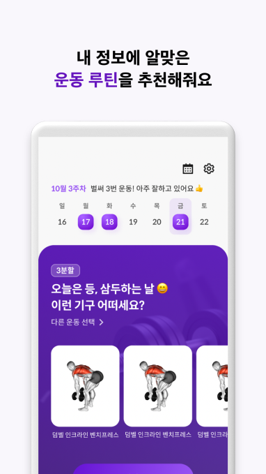

# [🏋️ HealthyUp](https://play.google.com/store/apps/details?id=com.mashup.healthyup)

> 🚨 플레이스토어 다운로드는 가능하지만 서버 유지비용 문제로 서비스 이용이 중단된 상태입니다🥲

운동중 가장 대표적인 헬스를 시작하는 사람들이 주변에도 많은데, 어떤 운동을 얼마나 해야할지에 대해 막막해 하는 사람이 많습니다.

헬시업은 운동을 처음하시는 분들을 위해 AI와 함께 재미있게 운동을 할 수 있게 도움을 주는 서비스입니다.

AI 운동 강도 추천을 통하여 본인에게 맞는 수준의 운동을 하게 도움을 드립니다.
AI 트레이너가 운동에 대해서 자세히 설명해주고 갯수도 세어줍니다. 트레이너의 목소리에 맞춰 같이 운동하며 운동 지식도 얻어가세요.

늘 같은 운동만 하게 되는, 혹은 운동을 배웠음에도 헬스장에만 가면 런닝머신 덕후가 되는 사람들에게 기준점이 되고자 합니다. HealthyUp과 같이 운동을 시작해보세요.

## 🚀 주요 기능

|  |  |
| ---------------------------------------------------- | ------------------------------------------------------ |
| 오늘의 운동 추천                                     | 운동중 오디오 음성 코칭                                |
|  |    |
| 운동 완료 후 동물뱃지 획득                           | 운동이력 관리                                          |

## 🔧 사용한 기술

- 메인: React, TypeScript
- 스타일: SCSS(module)
- 상태관리: React Query
- 모듈,번듈러: Webpack
- 패키지 매니저: Yarn Berry(Yarn2)

## 연관 레포지토리

- [Backend](https://github.com/mash-up-kr/HellTaBus_Backend)
- [Android](https://github.com/mash-up-kr/HellTaBus_Android)
- [Design](https://github.com/mash-up-kr/HellTaBus_Design)
